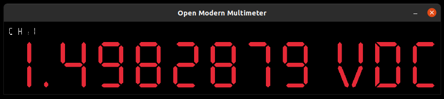

# open-modern-multimeter
Open Modern Multimeter - virtual visualization for remote multimeter physical data measurements. Modern data loggers extension.

## Motivations
When you create your own precision measurements instruments for physical values, some times you need to see current values.
Those exiting moments, when you can see expected data sets with important values, you can say "wow"!

In general, this is simple tool for visualization data values for learning and fun with measurements in electronics!

### What you can see in UI in this program



## How to run

### From exists Makefile
```bash
$ make run
```

### From built release
```bash
$ cargo build --release

$ ./target/release/open-modern-multimeter --help
```


## Features and arguments list in program

``bash
$ ./target/release/open-modern-multimeter --help
Open Modern Multimeter 
Reads values from an external multimeter via a serial port and displays measurement values in
real-time in a UI

USAGE:
    open-modern-multimeter <port> <baud> <channel_no> <unit> <window_position> [color]

ARGS:
    <port>               The device path to the serial port
    <baud>               The baud rate for communication
    <channel_no>         The channel number to display
    <unit>               The unit of measurement
    <window_position>    Setting up program window position on the screen <x_pos>_<y_pos>, where
                         x_pos and y_pos are in range {1..4} (i.e. 3_3 in the middle of the
                         screen)
    <color>              Color of the display values: r for red, g for green, b for blue
                         (default color is red if not specified) [default: r]

OPTIONS:
    -h, --help    Print help information
```
