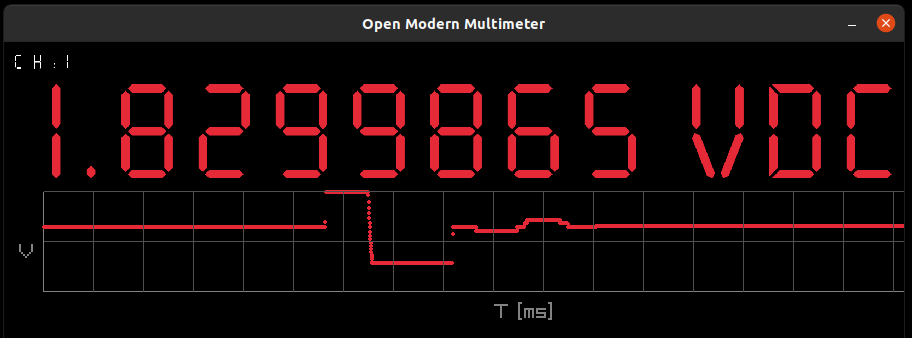
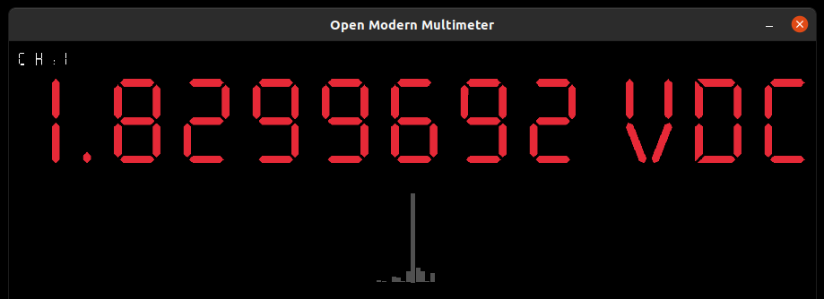
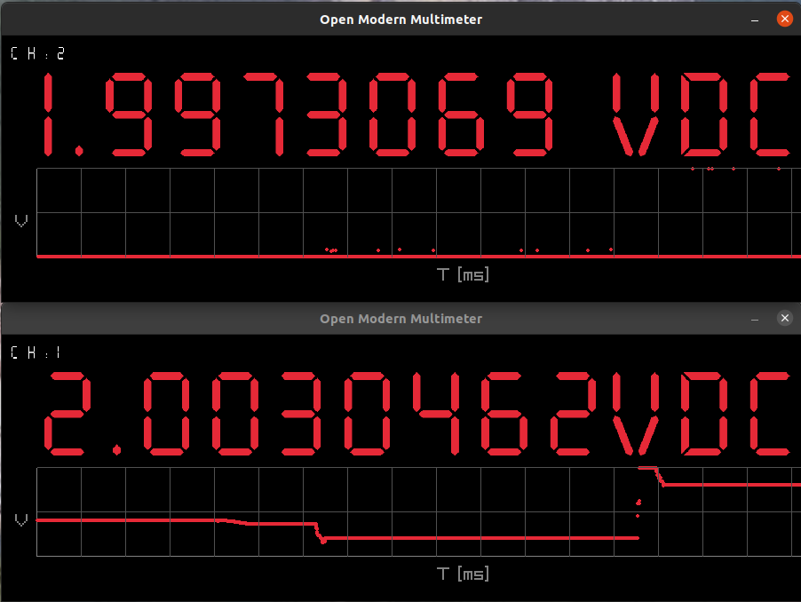

# open-modern-multimeter
Open Modern Multimeter - virtual visualization for remote multimeter physical data measurements. Modern data loggers extension.

## Motivations
When you create your own precision measuring instruments for physical values, sometimes you need to see the current values ​​on your PC/laptop/Mac.

Those exciting moments when you can see the expected data sets with important values ​​on your desktop give you the power to express and say “wow, it works!” :-)

Overall, it is a clever tool to visualize data values ​​for learning and having fun with measurements in electronics and measurement!

The idea is trivial. When you have a device that records real-time measurement values ​​to USB or RS-232 or RS-485 port, this tool will help you display these values ​​in 7-segment display style on your computer screen.

The convenience is that you don’t have to look at the measuring instrument - the measurement results are visible in this program.

In program implementation exists constants to reading measurements from multimeters like `OWON XDM1041` and `AGILENT 34401A` (connected by USB interface) or other similar - SCPI protocol support in meter is required.


### What you can see after running this program?

#### Standard multimeter view with value


#### Extended multimeter view with value and linear chart


#### Extended multimeter view with value and histogram statistics chart


#### You can collect all measurements from program start to the end in CSV file log

TO enable this feature is required additional option in program args. `--enable_csv_logger 1`.
Log file pattern `measurements_<numeric UNIX miliseconds grade timestamp for creation file moment>_<channel no from arg.>.csv`.
Default behaviour is to do not adding `0.0` values inside data logger (statistics are much more real, when you have `nano` an `micro` measurements values without zero - it was in my case).
Data records in CSV file pattern:
```
bash
#<numeric UNIX miliseconds grade timestamp>;<float measurementvalue>
```


## How to run

### RUST language ecosystem installation

Official page about `rustup` with instructions is [here](https://www.rust-lang.org/tools/install).
Installation of `rustup` is required to use RUST ecosystem from terminal - very easy way how to run this project in ~1 minute.

With RUST language and ecosystem, you can run this project on all modern operating systems like Linux, FreeBSD and others (yes, on your lovely Raspberry Pi _, too)!

### With cargo run
```bash
$ cargo run -- --port '/dev/ttyUSB0' --baud 115200 --channel_no 1 --unit VDC --window_position 4_4 --scpi_protocol_enabled 1 --enable_chart l --enable_csv_logger 0
```

### From built release
```bash
# build release
$ cargo build --release

# output location check
$ ./target/release/open-modern-multimeter --help
```


## How to create virtual terminal for testing/emulating measures/values (on Linux)
```bash
$ sudo socat PTY,link=/dev/ttyS10 PTY,link=/dev/ttyS111
$ sudo chmod a+wrx /dev/ttyS111
$ cargo run /dev/ttyS111 115200 1 VDC 3_3
```
If you would like to use real null-modem emulator running on Linux kernel level (with real timers), please use this [Linux driver for nullmodem](https://github.com/pitti98/nullmodem).

The general concept for emulating terminal in UNIX/Linux/*BSD operating systems is called [Pseudoterminal](https://en.wikipedia.org/wiki/Pseudoterminal).


## Features and arguments list in program

```bash
$ ./target/release/open-modern-multimeter --help
Open Modern Multimeter 
code base: https://github.com/bieli/open-modern-multimeter
Reads values from an external multimeter via a serial port and displays measurement values in
real-time in a UI

USAGE:
    open-modern-multimeter [OPTIONS] --port --baud --channel_no --unit --window_position --scpi_protocol_enabled

OPTIONS:
    -b, --baud
            The baud rate for communication

    -c, --color <color>
            Color of the display values: r for red, g for green, b for blue (default color is red if
            not specified) [default: r]

    -e, --enable_chart <enable_chart>
            Enable dynamic charts (h: histogram, l: linear) on bottom side of measurement screen.
            [default: ]

    -h, --help
            Print help information

    -l, --enable_csv_logger <enable_csv_logger>
            Enable measurements logger data appender from every value presented in app. on display.
            [default: ]

    -n, --channel_no
            The channel number to display

    -p, --port
            The device path to the serial port

    -s, --scpi_protocol_enabled
            Setting up SCPI protocol for reading measurements from all laboratory multimeters (SCPI
            'MEAS?' command send and parse response as measurement value; possible scentific
            representation of value)

    -u, --unit
            The unit of measurement

    -w, --window_position
            Setting up program window position on the screen <x_pos>_<y_pos>, where x_pos and y_pos
            are in range {1..4} (i.e. 3_3 in the middle of the screen)
```


### Real example from precision miliVolt meter measurements and reference device

## Configuration
 - precision miliVolt meter - reading from terminal as SCPI interface ('MEAS?' cmd. before reading + new line separator)
 - reference device - direct values from terminal (float values on terminal + new line separator)
 
## How to run program

### Release 
```bash
$ cargo build --release
```

### Run first open meter UI in one terminal
```bash
$ ./target/release/open-modern-multimeter --port '/dev/ttyUSB0' --baud 115200 --channel_no 1 --unit VDC --window_position 4_2 --scpi_protocol_enabled 0 --enable_chart l --enable_csv_logger 0
```

### Run second open meter UI in second terminal
```bash
$ ./target/release/open-modern-multimeter --port '/dev/ttyUSB1' --baud 115200 --channel_no 2 --unit VDC --window_position 4_4 --scpi_protocol_enabled 1 --enable_chart l --enable_csv_logger 0
```

### This is great effect of configuration with two real meters UIs on one screen



## Contribution to project

This is Open Source initiative and any ideas are welcome ;-)
Feel free to add any PRs or ISSUEs to this project.

